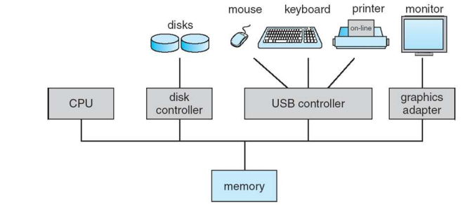
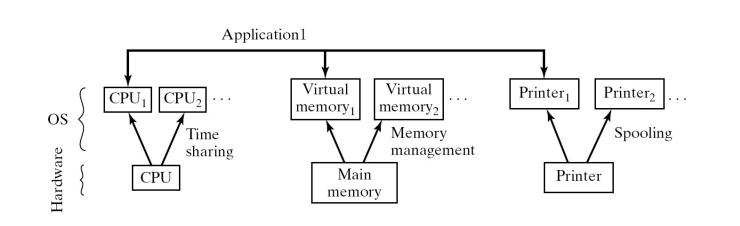
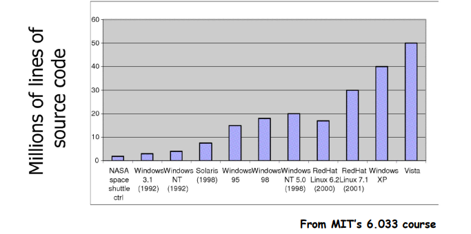
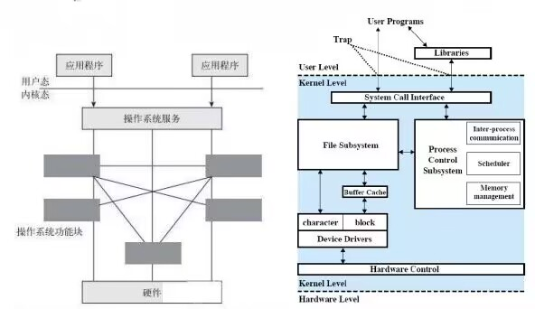
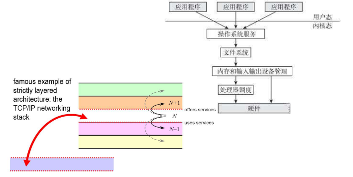
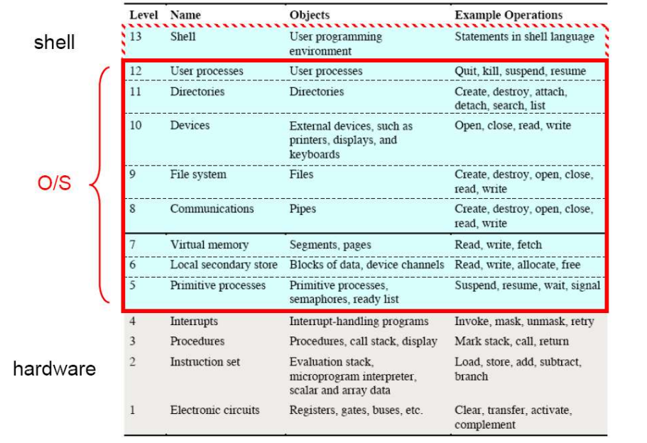
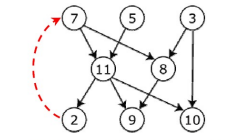
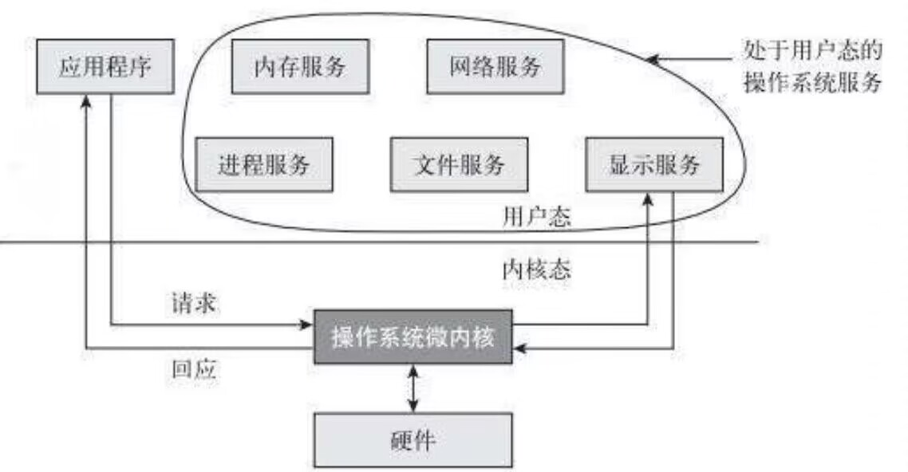

# 课前须知

> 不点名，不签到，但是会问问题
~~回答问题 可以回答不上来~~

## 关于课程
> [课程主页](https://github.com/tto1008/OS2023.github.io)
 https://github.com/tto1008/OS2023.github.io
### 课程介绍

> 最接近硬件的软件层

- 前几周课比较慢，后续进程快。

- 要读其他书，要筛选，一周都会在40面左右。

### 助教

```
童成伟，cwtong@mail.ustc.edu.cn
马龙，longm@mail.ustc.edu.cn
叶骋，kvrieve@mail.ustc.edu.cn
钱辉，qh200836@mail.ustc.edu.cn
```

### 参考资料

```
Suggested reading
Recommended further reading:
 Operating Systems: Three Easy Pieces
·http://pages.cs.wisc.edu/~remzi/OSTEP/
 Operating Systems: Principles and Practice
·http://ospp.cs.washington.edu/
 Xv6, a simple Unix-like teaching operating system
·http://pdos.csail.mit.edu/6.828/2012/xv6.html
 浪潮之巅，吴军，人民邮电出版社，2013年7月第二版

Suggested video
Labs for OS
 MIT-6.0S81:Operating Systems
 Vx6 System
 可在b站上找中文字幕

Suggested website
 1.Stack Overflow
 2.chatgpt(慎用，实验强烈建议不要用，可以检查出来)
```

### 关于评分

- 目前:作业10%，实验20%，期末考试70%，可能有期中考试，会挑分。

- 可以将实验提高比例，减少期末考试比例。

### 关于作业

- 作业有课本题，还有其他考研题，每周不一定有作业，看周进程，一般15周有10~12周作业，网上基本都有答案。

- 大作业（实验）不超过6次，大概框架网上有参考，但是实验很重要，大部分代码用于理解，核心代码自己填写，同时要有大部分debug。

- 对于迟交作业，不允许迟交，交作业时间当周周日，在bb系统上发布作业and提交作业（pdf手写，中英文都行）。

- 大作业是分组还是个人未定。

### 关于期末考试

 > 半开卷，带一张A4纸,不准打印，要纯手写。

### 关于推荐的学习方法

> Virtualization + Abstraction
```
Task
Algorithm
Program
Instruction Set
Architecture
Microarchitecture
Logic Gates
Devices
```

# 第一章 Introduction to OS

## OS的职责
- OS是计算机系统体系结构中的一个层次
 - [x] 自上而下的视角：提供便捷的用户界面
 - [x] 自下而上的视角：高效的资源管理器
 - [x] 设计一个操作系统
 - [x] 操作系统架构

### 电脑硬件
- 电脑系统

<p align="center">
  
  <p align="center">
   <span> 电脑系统</span>
  </p>
</p>

### 操作系统能做到什么
#### 电脑的结构层面
- [x] 应用(虚拟机器接口Virtual Machine Interface)
- [x] OS
- [x] 硬件(物理机器接口Physical Machine Interface)
> 操作系统是
> > 1. 系统软件中最靠近硬件的层次。
> > 2. 负责完成与硬件相关但与应用程序无关的所有基本任务。

#### 操作系统的功能特性
- OS作为一个服务提供者
  > 提供每个用户需要的设施/服务
- OS作为一个管理者
  > 1. 高效而公平地分配资源
  > 2. 解决资源之间的冲突请求
  > 3. 防止错误和不当使用计算机
> 即，高效，公平，安全地使用资源
- OS作为一个扩展机器
  > 将不美观(不直观)的硬件转化为美观(可视化)的抽象概念。

##### 虚拟机器(虚拟机)
###### 虚拟机的作用和特点
- 抽象机器的软件仿真
  > 使其看起来像硬件具有所需的功能
  > 
  > 从一个硬件和操作系统上的程序在另一个上运行
- 编程简单
  > 每个进程认为它拥有所有的内存/CPU时间
  > 
  > 每个进程认为它拥有所有的设备
  > 
  > 不同的设备看起来具有相同的接口
  > 
  > 设备接口比原始硬件更加强大
  > > 位图显示器变为窗口系统
  > > 
  > > 以太网卡变为可靠、有序的网络(TCP/IP)
- 隔离故障
  > 进程无法直接影响其他进程
  > 
  > 错误不会导致整个系统崩溃
- 保护和可移植性
  > java接口在许多平台上安全稳定

###### 虚拟化的原则

<p align="center">
  
  <p align="center">
   <span> 虚拟化的原则</span>
  </p>
</p>

#### OS的功能特性总结
- 自上而下（用户）视角
  > 操作系统是一个便捷的应用程序界面
  > 
  > 操作系统隐藏了必须执行的混乱细节
  > 
  > 操作系统向用户呈现了一个更容易使用的虚拟机
- 自下而上（硬件）视角
  > 操作系统执行高效的资源使用和管理
  > 
  > > 时间复用：每个程序都有使用资源的机会
  > >
  > > 空间复用：每个程序都可以使用资源的一部分
- 软件层面视角
  > 操作系统是可演进和可扩展的软件
  > > 操作系统允许有效地开发和引入新的系统功能，而不会干扰服务。

### OS的定义
- 没有普遍接受的定义
- “当您订购操作系统时，供应商发送的一切”是一个很好的近似定义
  > 但各种定义差异巨大
- “始终在计算机上运行的那个程序”被称为内核（kernel）。
  > 其他一切都要么是系统程序（与操作系统一起提供），要么是应用程序。

### 增加软件复杂性

<p align="center">
  
  <p align="center">
   <span> 增加软件复杂性</span>
  </p>
</p>

### 关于书籍《The Mythical Man Month》
- 在大型项目上，程序员每年只能产生1000行经过调试的代码。
- 大型项目设计
  - 1/3 计划
  - 1/6 编码
  - 1/4 模块测试
  - 1/4 系统测试
- 人力资源和时间不可互换
  - 工作不能完全并行化
  - 工作必须划分成大量模块
  - 调试高度是顺序的
- 没有银弹：
  - 更好的高级编程语言、人工智能、专家系统...

### 为什么设计一个“好的”OS是很困难的？
- [x] 根据摩尔定律，硬件每10年改进100倍，但现在的操作系统在某些方面（比如可靠性）比70年代的Unix版本7还糟糕
- [x] 为什么会出现这种状况呢？
  > OS的设计者对于需要什么必须非常清楚，但什么是“好的”OS并不明确
  > OS所支持的app一直在以无法预期的方式快速变化
  > OS无法有效地解耦成独立的模块。航空母舰比OS更复杂，但是航母能更好地分成相互隔离的部分
  > 没有人能理解500万行的代码，结果无法充分优化也就不奇怪了
  > …

## 操作系统架构
- 单内核结构（Monolithic structure）
- 分层结构（Layered structure）
- 微内核结构（Microkernel structure）

### 为什么需要软件架构？
- 操作系统变得庞大而复杂
- 随着代码规模的增加，出现了各种问题
  - 操作系统交付（新的或升级）经常拖延
  - 操作系统存在潜在的错误，需要迅速修复
  - 性能通常不如预期
  - 部署一个不容易受到安全攻击的操作系统几乎是不可能的
- 因此，迫切需要一个精心设计的软件架构
  - 具有清晰、最小接口的层和/或模块
  - 目标是可以轻松更改（修复、升级、扩展）其中一部分，而不影响其他部分。
- [x] 良好定义的接口允许替换其中一部分而不影响其周围环境。

### 单内核结构
- [ ] "大混乱"：一组过程，可以在需要时调用任何其他过程
- [ ] 不良示例：MS-DOS，原始的UNIX

<p align="center">
  
  <p align="center">
   <span> 单核结构</span>
  </p>
</p>

### 分层结构
- [x] 单内核操作系统
  - 没有人有构建真正大型软件系统的经验
  - 由相互依赖和互动引起的问题被严重低估了
  - 随着操作系统的增长，这种缺乏结构变得无法持续

- [x] 引入分层结构和信息抽象
  - 每个层次仅使用下层提供的操作来实现
  - 它不需要知道它们是如何实现的
  - 因此，较低的层次隐藏了某些数据结构、私有操作和硬件的存在，对上层是透明的。

- [x] 各层可以独立调试和替换，而不会影响上下的其他层。

<p align="center">
  
  <p align="center">
   <span> 分层结构</span>
  </p>
</p>

- [x] 操作系统设计层次结构的理论模型

<p align="center">
  
  <p align="center">
   <span> 分层结构理论模型</span>
  </p>
</p>

- [x] 分层的主要困难
  > ...适当地定义各个层次！
  > 
  > 只有当所有功能依赖关系可以整理成有向无环图（DAG）时，才可以进行分层
  > 
  > 但可能会存在循环依赖（“循环”）的冲突。

<p align="center">
  
  <p align="center">
   <span> 在有向无环图（DAG）的基础上出现的循环依赖</span>
  </p>
</p>

- [x] 操作系统组织中的循环依赖
  > 例如：磁盘驱动程序例程与CPU调度程序例程
- [x] 另一个困难：效率
  > 层次结构层数越多，从函数到函数的间接性越大，函数调用的开销就越大
  >
  >  对严格的分层结构的反弹：返回到更少的层次，但功能更多。

### 微内核结构
- [x] 微内核是一个精简的操作系统核心，仅包含必要的操作系统功能。
- [x] 这个理念是通过将尽可能多的功能从内核移动到用户空间来“瘦身”内核。
- [x] 许多传统上包括在操作系统中的服务现在作为用户进程运行的外部子系统。
  > - 设备驱动程序
  > - 文件系统
  > - 虚拟内存管理器
  > - 窗口系统
  > - 安全服务等

<p align="center">
  
  <p align="center">
   <span> 微内核结构</span>
  </p>
</p>

- [x] 微内核方法的优点
  > - 可扩展性：通过在用户空间添加新服务，扩展基于微内核的操作系统更容易，而不是在内核中添加。
  > - 可移植性：更容易移植到新的CPU，因为只需要在微内核中进行更改，而不需要在其他服务中进行更改。
  > - 可靠性和安全性：在内核模式中运行的代码要少得多；用户空间服务的故障不会影响内核空间。

- [x] 微内核方法的缺点
  > - 再次，由于来自用户空间到内核空间的通信，性能开销较大。
  > - 并不总是现实的：一些功能（I/O）必须保留在内核空间，迫使“策略”和“机制”之间分离。

## 操作系统的历史和特性
## 操作系统的类型
